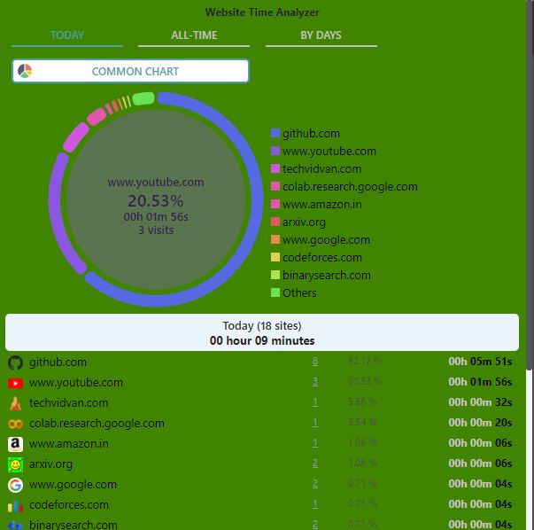
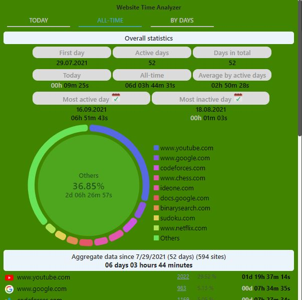
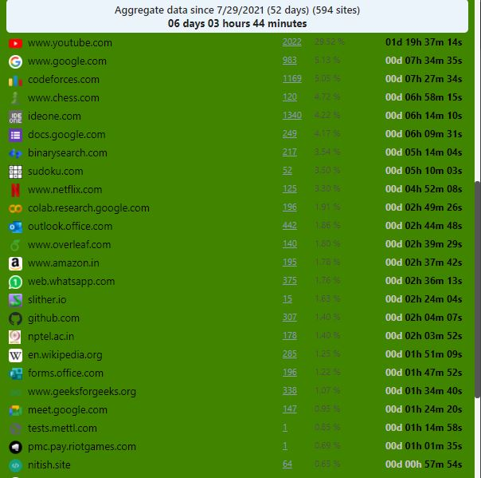
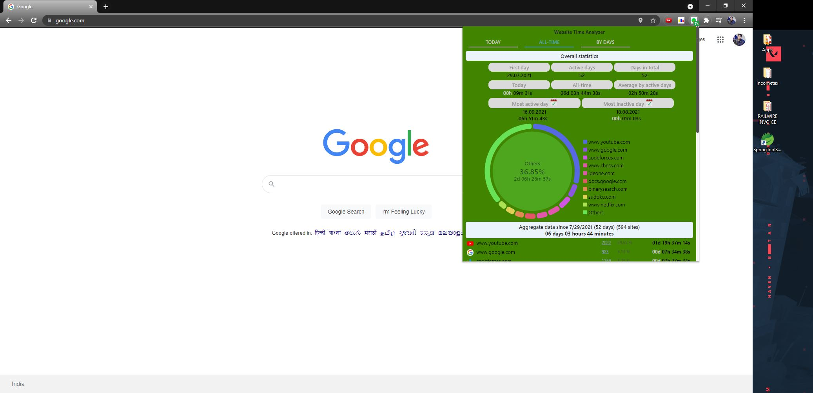

# Website Time Analyzer
## About
A ```Google chrome extension``` to track and analyze the time spent on differnet websites on the internet. This extension stores the information time spent by the user on different sites on the google chrome web browser and analyzes the stored information to visualize the time spent during the current day and all time. The tabulation of information also shows the count of visits total time spent on the website from the starting day since installation and the percentage of all of the sites visited.

Language Used  - ```Javascript```  
Library  Used  - ```JQuery```

## Installation

### To install the extension on local pc:  
- Clone this repository on the local system
- Open the chrome browser and navigate to ```chrome://extensions/```
- After reaching the site enable ```the Developer mode```
- Click on ```Load Unpacked``` present on the top left of the site
- Navigate to the place where the repository was cloned and select the src folder
- The extension will now install on your chrome browser
  
  
  
## Some Visuals while working

### Image showing the stats related to visited sites for the current day

  
### Stats relating the overall time


### List of websites visited by the user


### Normal view of the extension working 



